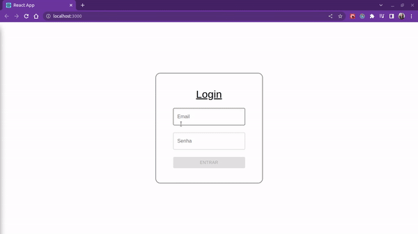

# Carteira de gerenciamento de gastos.

Este é um dos projetos realizados durante o meu período como estudante na [*Trybe*](https://www.betrybe.com/).

### O que foi desenvolvido:

Foi feita uma aplicação com as tecnologias, *React* e *Redux*, que utiliza das cotações monetárias fornecidas pela API, [Awsomeapii](https://docs.awesomeapi.com.br/api-de-moedas).
Com o objetivo de desenvolver uma carteira digital para o controle de gastos, convertendo-os para o Real (BRL).

### Como funciona:

  

* O usuário informa o valor e uma descrição;
* Seleciona a moeda em que gastou;
* O método de pagamento e para qual fim aquele valor foi gasto;
* E é adicionada a despesa dentro da tabela.

## Ferramentas utilizadas

Este projeto foi desenvolvido com o intúito de se aprender a utilizar a ferramenta *Redux*, mas além desta, também foi utilizado:

1. HTML e CSS;
2. JavaScript;
3. React, React Router, RTL;
4. Redux e Redux Thunk;
5. Biblioteca [MUI](https://mui.com/pt/) para a estilização.

-------------

> Os **arquivos de testes** estão *quebrados*, sinta-se a vontade para clonar o repositório e arrumá-los caso queira :wink:.
